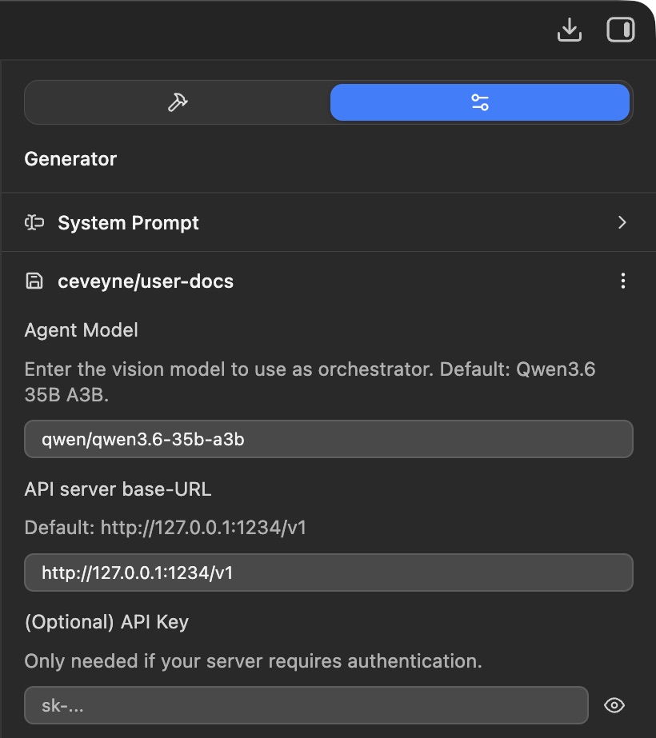
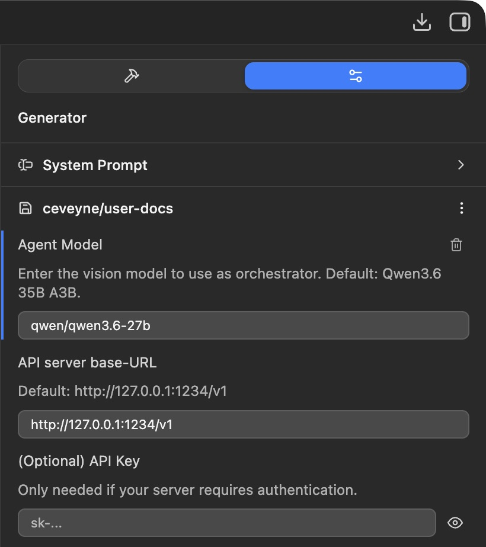
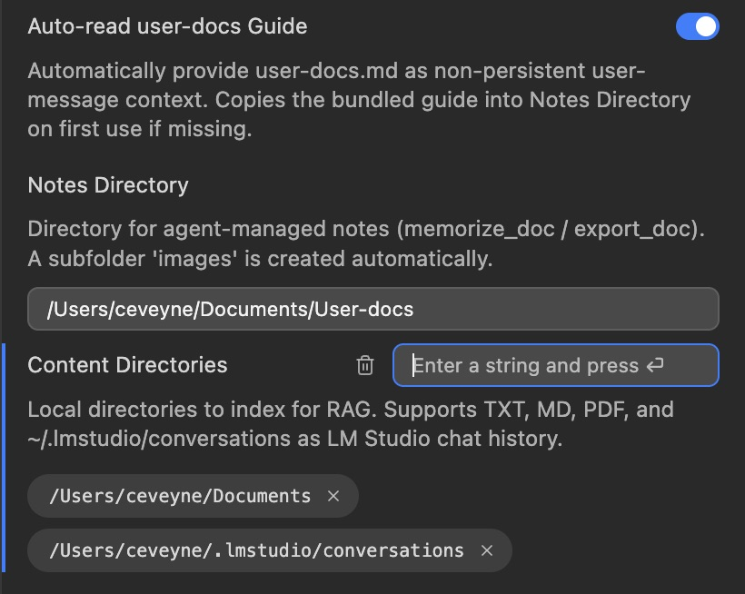
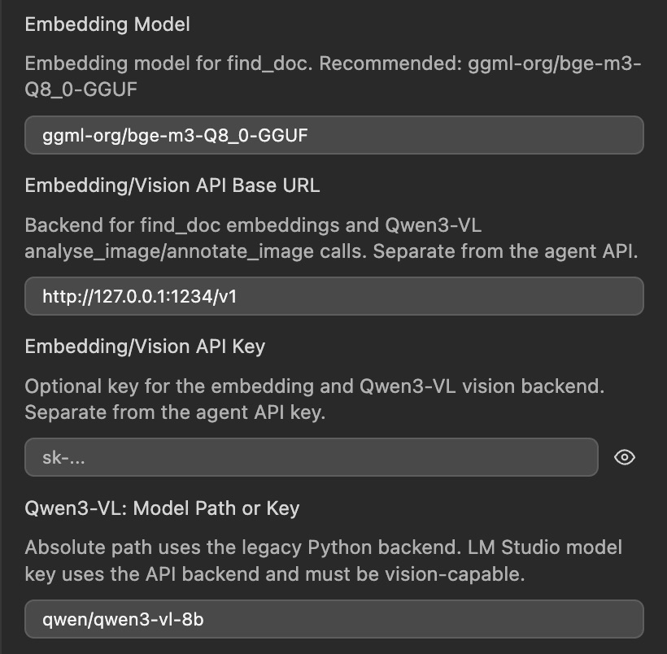
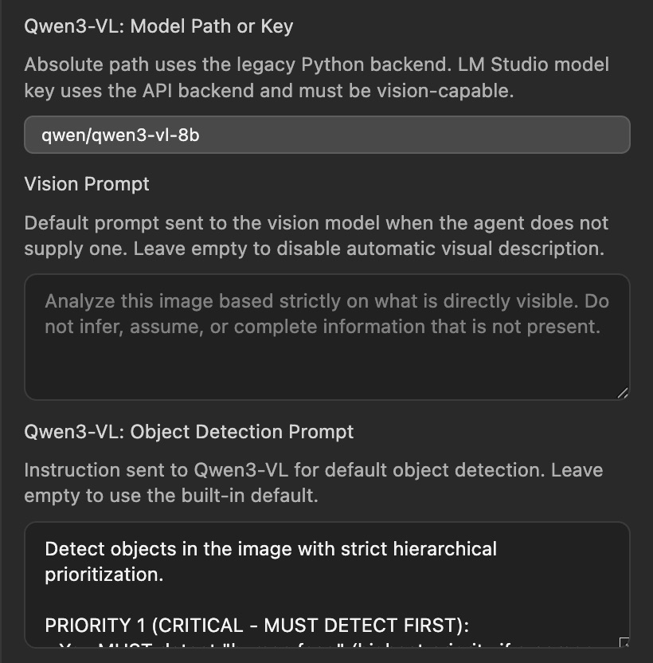

# user-docs

> **Documentation-only repository**
>
> This repository contains _only_ the user documentation for **user-docs** (Markdown + images).
> It intentionally contains **no LM Studio plugin code** and is **not installable**.
>
> Looking for the actual plugin? See: https://lmstudio.ai/ceveyne/user-docs

> **LM Studio Plugin — Personal Knowledge Management supported by vision-capable Agents**

Search your personal conversations, Markdown and PDF documentation from within an LM Studio chat. The plugin retrieves the most relevant text sections and, where available, delivers the images embedded in those sections directly into the conversation.

## Table of Contents

- [Key benefits](#key-benefits)
- [What it does](#what-it-does)
- [Technical requirements](#technical-requirements)
- [Setup](#setup)
  - [Overview — Deployment scenarios](#deployment-scenarios)
  - [Setup step-by-step](#setup-step-by-step)
- [Troubleshooting quick links](#troubleshooting-quick-links)
- [Configuration reference](#configuration-reference)
- [Tools](#tools)
- [Setup guide images](#setup-guide-images)
- [More detailed user docs](#detailed-user-docs)
- [Changelog](#changelog)
- [License](#license)

<a id="key-benefits"></a>

## Key benefits

Probably, you have documents. Lots of them? Plugin guides, device manuals, personal notes, old conversations with useful information buried in them? And when you actually need something specific, good luck finding it again — especially if the answer sits on page 327 of a PDF or in a chat from three weeks ago.

**LM Studio Plugin: user-docs — Personal Knowledge Management supported by vision-capable Agents.**

- Hybrid semantic search (BM25 + embeddings) across your local documents
- Image co-retrieval: screenshots and diagrams embedded in documentation are delivered alongside text
- Full PDF support with on-demand page rendering
- LM Studio conversation history as a searchable knowledge base
- Brave image search integration for visual research — results registered directly as `pN` candidates
- All processing is local — no data leaves your machine
- Agent can write, update, and manage notes autonomously

> **TL;DR:** You ask a question. The agent searches through all your docs, finds the answer, shows you the relevant screenshot if one exists, and gives you a short precise response. No more Ctrl+F across 47 files.

<a id="what-it-does"></a>

## What it does

When you ask a question, **user-docs** searches your local documentation directories using hybrid retrieval (BM25 + embeddings). For each retrieved text chunk the plugin extracts image references — including embedded base64 images and Obsidian wikilinks — generates previews, and registers them as `pN` entries in `chat_media_state.json`. This means `review_image`, `analyse_image`, `annotate_image` can operate on retrieved screenshots without any extra configuration.

Known source files or conversations can be image-fetched directly via `fetch_image`. PDF pages can be rendered on demand via `extract_image`.

## Workflow examples

See [USER_GUIDE.md](docs/USER_GUIDE.md) for in-depth documentation and use cases.

---

<a id="technical-requirements"></a>

## Technical requirements

### Hardware

In addition to the resources your main agent model requires, keep in mind:

- **VRAM overhead:** The embedding model and vision model add approximately **6.5 GB VRAM** on top of your agent model's requirements.
- **Context window:** As with many "agentic" tasks, a large context window is needed — especially when working with agent instructions. A minimum of **32 768 tokens** is recommended; smaller windows will struggle to hold retrieved chunks and conversation history simultaneously.
- **KV Cache stability:** The larger the context window, the more important a stable cache becomes. Both MLX and GGUF backends have seen significant improvements in this area recently — make sure you're on an up-to-date build.
- **Model selection criteria** are comparable to those for coding tasks: favor models with strong instruction-following, reasoning, and long-context performance over raw parameter count alone.

### Software

- **Python 3.9+** — Required for the plugin's internal processing (embedding generation, document indexing). The plugin creates isolated virtual environments internally; nothing pollutes your system Python.
- **LM Studio** — Latest runtime engines highly recommended: `lms runtime update --all`.
- **LM Studio Server**

> ⚖️ **Distributed setup:** You can run the LM Studio Server on a powerful machine in your network while using the plugin from a lightweight client. Documents are always local to where the plugin runs; only model inference is offloaded via API calls. See Deployment scenarios below.

---

<a id="setup"></a>

## Setup

<a id="deployment-scenarios"></a>

### Overview — Deployment scenarios

Customize your setup based on where LM Studio Server runs:

#### Everything Local (Simplest)

All components run on one machine. LM Studio acts as both client and server.

```
┌──────────────────────────────────────────────────────────────────┐
│  MacBook Pro M5                                                  │
│                                                                  │
│  ┌────────────────────────────────────────────────────────────┐  │
│  │  LM Studio App                                             │  │
│  │                                                            │  │
│  │  ┌──────────────────────────────────────────────────────┐  │  │
│  │  │  Plugin: user-docs                                   │  │  │
│  │  │                                                      │  │  │
│  │  │  vision-capability-primer: qwen/qwen3-vl-4b          │  │  │
│  │  └──────────────────────────────────────────────────────┘  │  │
│  │                           │                                │  │
│  │                           │ OpenAI-compat. API             │  │
│  │                           ▼                                │  │
│  │  ┌──────────────────────────────────────────────────────┐  │  │
│  │  │  LM Studio Server (local)                            │  │  │
│  │  │  baseUrl: http://127.0.0.1:1234/v1                   │  │  │
│  │  │  Agent Model: qwen/qwen3.6-27b                       │  │  │
│  │  │  Embedding Model: ggml-org/bge-m3-Q8_0-GGUF          │  │  │
│  │  │  Vision Model: qwen/qwen3-vl-8b                      │  │  │
│  │  └──────────────────────────────────────────────────────┘  │  │
│  └────────────────────────────────────────────────────────────┘  │
│                                                                  │
└──────────────────────────────────────────────────────────────────┘

```

#### Distributed (e.g., MacBook → Mac Studio)

LM Studio Client and LM Studio backend share one machine.
The LM Studio Server (agent inference) runs on a dedicated, more powerful machine.

```
┌──────────────────────────────────────────────────────────────────┐
│  MacBook Neo                                                     │
│                                                                  │
│  ┌────────────────────────────────────────────────────────────┐  │   ┌─────────────────────────────┐
│  │  LM Studio App                                             │  │   │  Mac Studio M3 Ultra        │
│  │                                                            │  │   │                             │
│  │  ┌──────────────────────────────────────────────────────┐  │  │   │                             │
│  │  │  Plugin: user-docs                                   │  │  │   │  LM Studio Server           │
│  │  │                                                      │  │  │   │                             │
│  │  │  vision-capability-primer: qwen/qwen3-vl-4b          │  │  │   │                             │
│  │  └──────────────────────────────────────────────────────┘  │  │   │  Agent Model:               │
│  │                           │                                │  │   │  qwen/qwen3.6-27b           │
│  │                           │ OpenAI-compat. API ───────────────│──▶︎│  http://<studio-ip>:1234/v1 │
│  │                           ▼                                │  │   │                             │
│  │  ┌──────────────────────────────────────────────────────┐  │  │   │                             │
│  │  │  LM Studio Server (local)                            │  │  │   │                             │
│  │  │  baseUrl: http://127.0.0.1:1234/v1                   │  │  │   │                             │
│  │  │  Agent Model: qwen/qwen3.6-27b                       │  │  │   │                             │
│  │  │  Embedding Model: ggml-org/bge-m3-Q8_0-GGUF          │  │  │   │                             │
│  │  │  Vision Model: qwen/qwen3-vl-8b                      │  │  │   │                             │
│  │  └──────────────────────────────────────────────────────┘  │  │   └─────────────────────────────┘
│  └────────────────────────────────────────────────────────────┘  │
│                                                                  │
└──────────────────────────────────────────────────────────────────┘

```

> `baseUrl` must point to the reachable server. Configure via **Plugin Settings → API server base-URL**.

---

<a id="setup-step-by-step"></a>

### Step 0 — Install the Plugin

Install and activate **[ceveyne/user-docs](https://lmstudio.ai/ceveyne/user-docs)** in LM Studio.


> 💡 In case it's not activated right away after download, activate the **user-docs** plugin by choosing it from the model-loader `Your Generators`.

---

### Step 1 — Activate LM Studio Server

The plugin requires a running local server to communicate with models and tools.

- Open **Developer** → **Local Server** on the left panel
- Enable the green toggle under **Local Server**
- Load at least one model from the right side (this becomes your agent model)


---

### Step 2 — Choose Your Agent Model

The agent model orchestrates all plugin commands and accompanies you through chats. Two recommended options:

| Option                      | Setting                | Characteristics                   |
| --------------------------- | ---------------------- | --------------------------------- |
| **Default** (fast, compact) | `qwen/qwen3.6-35b-a3b` | Good for clearly instructed tasks |



| Option                               | Setting            | Characteristics                             |
| ------------------------------------ | ------------------ | ------------------------------------------- |
| **More powerful** (slower, flexible) | `qwen/qwen3.6-27b` | Handles complex and open-ended tasks better |



> 💡 Other OpenAI-compatible APIs work as well: other local backends (oLMX, Unsloth Studio), cloud providers (OpenAI, Claude). Configure via **Plugin Settings → Agent Model, API server base-URL, (Optional) API Key**.

---

### Step 3 — Decide Your Use Case

Determine what you want from user-docs. This determines which directories to configure and whether the auto-read guide should be on or off:

**What content do you want indexed?**

- Local Markdown / TXT notes?
- PDF manuals?
- LM Studio conversation history?
- External docs from GitHub / URLs?

**Primary purpose:**

- **Document management (PKM)** → Keep `Auto-read user-docs Guide` ON (default) — agent starts fully operational every session. Sessions start slightly slower.
- **Multi-backend access only** → Set it OFF — faster startup, guide available on demand via the agent anytime.

---

### Step 4 — Configure Content Directories

Three directory types are supported:

| Type                        | Access     | Purpose                                                                                                                                               |
| --------------------------- | ---------- | ----------------------------------------------------------------------------------------------------------------------------------------------------- |
| **Notes Directory**         | Read-write | Agent stores notes here (`memorize_doc`, `export_doc`). Contains `USER-DOCS.md` as the plugin's core guide. Recommended path: `~/Documents/User-docs` |
| **Content Directories**     | Read-only  | Your documents — PDF, TXT, MD files fully searchable and indexable                                                                                    |
| **LM Studio Conversations** | Read-only  | Add `~/.lmstudio/conversations` to include chat history in the index                                                                                  |


With conversations added:



> Configure via **Plugin Settings → Notes Directory / Content Directories**.
> Set `Auto-read user-docs Guide` toggle based on your Step 3 decision.

---

### Step 5 — Embedding Model + Vision Model

Two small models for search and image analysis:

| Setting                     | Recommended Value           | Purpose                                                                 |
| --------------------------- | --------------------------- | ----------------------------------------------------------------------- |
| **Embedding Model**         | `ggml-org/bge-m3-Q8_0-GGUF` | Semantic text search across documents (`find_doc`)                      |
| **Vision Model (Qwen3-VL)** | `qwen/qwen3-vl-8b`          | Image analysis and object detection (`analyse_image`, `annotate_image`) |



> Both models should be loaded via the LM Studio Server. Other models are not recommended unless they're variants (finetunes, quantizations) of these standards.
> Configure via **Plugin Settings → Embedding Model / Qwen3-VL**.

---

### Step 6 — Vision Prompts (Optional Fine-Tuning)

Two prompt fields for image analysis behavior:

| Setting                             | Default | Purpose                                                                                                                                                                                                              |
| ----------------------------------- | ------- | -------------------------------------------------------------------------------------------------------------------------------------------------------------------------------------------------------------------- |
| **Vision Prompt** (`analyse_image`) | Empty   | Sent to the vision model when no explicit description is requested. Leave empty → visual descriptions only on agent request (recommended default). `analyse_image` always returns generation metadata automatically. |



| Setting                                        | Default                               | Purpose                                                                                                                                                                                             |
| ---------------------------------------------- | ------------------------------------- | --------------------------------------------------------------------------------------------------------------------------------------------------------------------------------------------------- |
| **Object Detection Prompt** (`annotate_image`) | Built-in hierarchical detection rules | Tells Qwen3-VL what to detect and mark with bounding boxes. The built-in default works well, but specifying a custom prompt per request gives precise control (e.g., "mark only the login button"). |


> Configure via **Plugin Settings → Vision Prompt / Object Detection Prompt**.

---

## First Search — Verify Everything Works

After completing all steps, test with a live search:

1. Open LM Studio chat
2. Ask anything about your indexed documents (e.g., "What documentation do I have?")
3. The agent should respond using `find_doc` results and screenshots if available

**Setup complete.** 🎉

---

<a id="troubleshooting-quick-links"></a>

## Troubleshooting quick links

| Issue                | See also                                                             |
| -------------------- | -------------------------------------------------------------------- |
| Server not reachable | Step 1 — check green toggle in Developer panel                       |
| Wrong model loaded   | Step 2 / Step 5 — verify settings match recommendations              |
| Empty search results | Step 4 — ensure Content Directories are populated and indexed        |
| Vision tools failing | Step 6 — confirm Qwen3-VL is vision-capable (`supportsVision: true`) |
| Python not found     | See chapter: "Install Python, if needed" below                       |

### Install Python, if needed

`find_doc`, PDF parsing, and `extract_image` require **Python 3.9+**. The vision MLX backend requires **Python 3.11+**.

The plugin searches for Python automatically. It probes well-known install locations in this order:

- **macOS** — python.org (`/usr/local/bin/python3.X`), Homebrew (`/opt/homebrew/bin/python3.X`), Xcode CLT, system `/usr/bin/python3`, then LM Studio's bundled Python as a last resort.
- **Windows** — python.org user installer (`%LOCALAPPDATA%\Programs\Python\Python3XX\python.exe`), system installer (`%ProgramFiles%\Python3XX\python.exe`), `%LOCALAPPDATA%\Python\bin\python.exe`, pyenv-win, then LM Studio's bundled Python as a last resort.

**If Python is not found:**

1. Download and run the standard installer from **[python.org/downloads](https://www.python.org/downloads/)**.
2. When the installer asks whether to add Python to PATH, answer **Yes** (this will not help LM Studio find Python directly, but causes no harm).
3. Restart LM Studio.

All packages are installed into isolated venvs inside the plugin directory; nothing is written to your system Python.

---

<a id="python-environments"></a>

### Python environments

The plugin creates and repairs isolated Python environments automatically:

| Environment                  | Used for                  | Minimum Python | Validation before reuse                |
| ---------------------------- | ------------------------- | -------------- | -------------------------------------- |
| `.rag-venv`                  | RAG parsing, PDF handling | 3.9+           | `python3`, `pip`, `docling`, `fitz`    |
| `.fastvlm/venv`              | local vision HTTP server  | 3.9+           | `python3`, `pip`, `fastapi`, `uvicorn` |
| `.fastvlm/qwen3vl_venv`      | MLX Qwen3-VL backend      | 3.11+          | `python3`, `pip`, `mlx_vlm`, `PIL`     |
| `.fastvlm/qwen3vl_gguf_venv` | GGUF Qwen3-VL backend     | 3.9+           | `python3`, `pip`, `llama_cpp`, `PIL`   |

Ready markers are only trusted when these checks pass. If an environment was deleted or is incomplete, the plugin rebuilds it instead of waiting until a later timeout.

<a id="configuration-reference"></a>

## Configuration reference

| Setting                 | Default                     | Description                                                                                                |
| ----------------------- | --------------------------- | ---------------------------------------------------------------------------------------------------------- |
| `model`                 | `qwen/qwen3.6-35b-a3b`      | Agent/orchestrator model                                                                                   |
| `baseUrl`               | `http://127.0.0.1:1234/v1`  | LM Studio API base URL                                                                                     |
| `apiKey`                | _(empty)_                   | API key (only if the server requires authentication)                                                       |
| `autoReadUserDocsGuide` | `true`                      | Provide `user-docs.md` as non-persistent user-message context and seed it into `notesDirectory` if missing |
| `notesDirectory`        | `~/Documents/User-docs`     | Notes write target; always indexed                                                                         |
| `contentDirectories`    | `~/Documents`               | Directories to index (TXT, MD, PDF)                                                                        |
| `embeddingModel`        | `ggml-org/bge-m3-Q8_0-GGUF` | Embedding model for semantic retrieval (must be loaded in LM Studio)                                       |
| `embeddingBaseUrl`      | `http://127.0.0.1:1234/v1`  | Embedding/Vision API Base URL                                                                              |
| `embeddingApiKey`       | _(empty)_                   | API key (only if the server requires authentication)                                                       |
| `qwen3VlModelPath`      | `qwen/qwen3-vl-8b`          | Absolute path to the Qwen3-VL model directory                                                              |
| `visionPrompt`          | _(empty)_                   | Default prompt for `analyse_image`. Leave empty to disable automatic description                           |
| `qwen3VlOdPrompt`       | `_(built-in)_`              | Instruction sent to Qwen3-VL for object detection (`annotate_image`)                                       |

<a id="tools"></a>

## Tools

| Tool              | Description                                                                                                         |
| ----------------- | ------------------------------------------------------------------------------------------------------------------- |
| `find_doc`        | Hybrid RAG search. Returns text context + registers embedded images as `pN` candidates.                             |
| `read_doc`        | Read a note file in full or partial form. Registers document images by default; base64 payloads are stripped.       |
| `fetch_image`     | Register all images from one exact filename, Markdown document, image file, or LM Studio conversation as `pN`.      |
| `extract_image`   | Render a PDF page to PNG via PyMuPDF and register it as `iN`.                                                       |
| `review_image`    | Present image candidates to the user for selection.                                                                 |
| `review_sequence` | Step through a sequence of images interactively.                                                                    |
| `analyse_image`   | Describe the pixel content of a `pN`/`iN`/`aN` image via FastVLM or the configured LM Studio Vision API backend.    |
| `annotate_image`  | Detect objects and draw bounding boxes via Qwen3-VL.                                                                |
| `show_image`      | Promote a `pN`/`iN` candidate to a visible chat image.                                                              |
| `skip_doc`        | Remove a `read_doc` result from the API context (token saving).                                                     |
| `memorize_doc`    | Write a new note to `notesDirectory` with YAML frontmatter.                                                         |
| `rewrite_doc`     | Overwrite an existing note.                                                                                         |
| `forget_doc`      | Delete a note from `notesDirectory`.                                                                                |
| `export_doc`      | Export the current chat as a Markdown note into `notesDirectory`.                                                   |
| `read_config`     | Return the current plugin settings as JSON so an agent can inspect live configuration values and assist with setup. |

<a id="setup-guide-images"></a>

## Setup guide images

The interactive setup guide (`SETUP.md`) references screenshots stored in `docs/initial-docs/images/`. These images are **not bundled inside the plugin** — they are excluded from both the build output and the LM Studio Hub upload to stay within the Hub file-count limit.

Instead, the plugin fetches the images lazily from this GitHub repository the first time the setup guide is triggered after a fresh install or update. The fetch is intentional and targets a fixed path in this repository (`docs/initial-docs/images/`). LM Studio has no built-in update mechanism — to install a new version, users must manually delete the existing plugin directory first. That typically removes the entire directory, so the fetch runs again after each reinstall; within a single install it uses the locally cached copies in `docs/initial-docs/images/` inside the plugin's install directory.

Only `SETUP.md` and `docs/initial-docs/images/` are tracked in this repository; all other files under `docs/initial-docs/` are git-ignored.

---

<a id="detailed-user-docs"></a>

## More detailed user docs

See [USER_GUIDE.md](docs/USER_GUIDE.md) for in-depth documentation, use cases, technical requirements, known issues, and more.

<a id="changelog"></a>

## Changelog

See [CHANGELOG.md](docs/CHANGELOG.md) for version history and release notes.

<a id="license"></a>

## License

MIT
