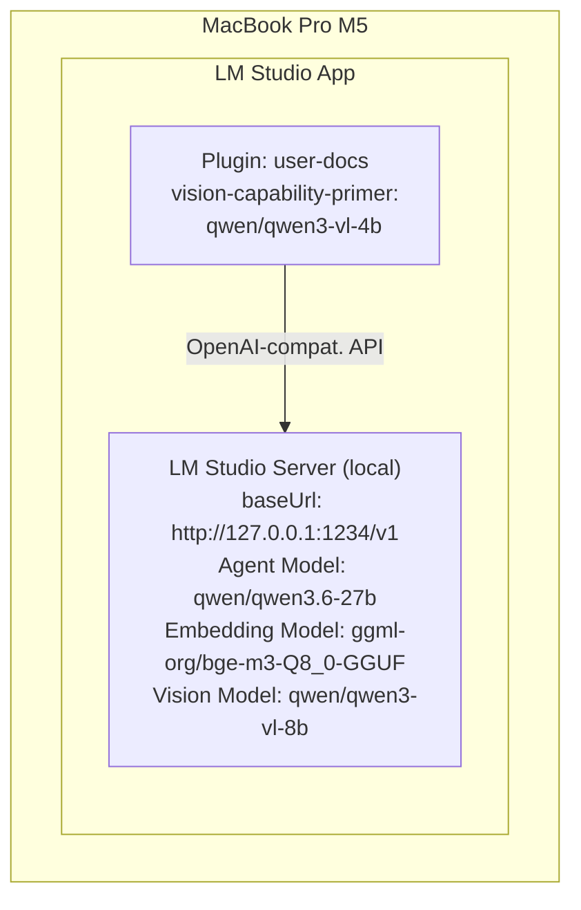
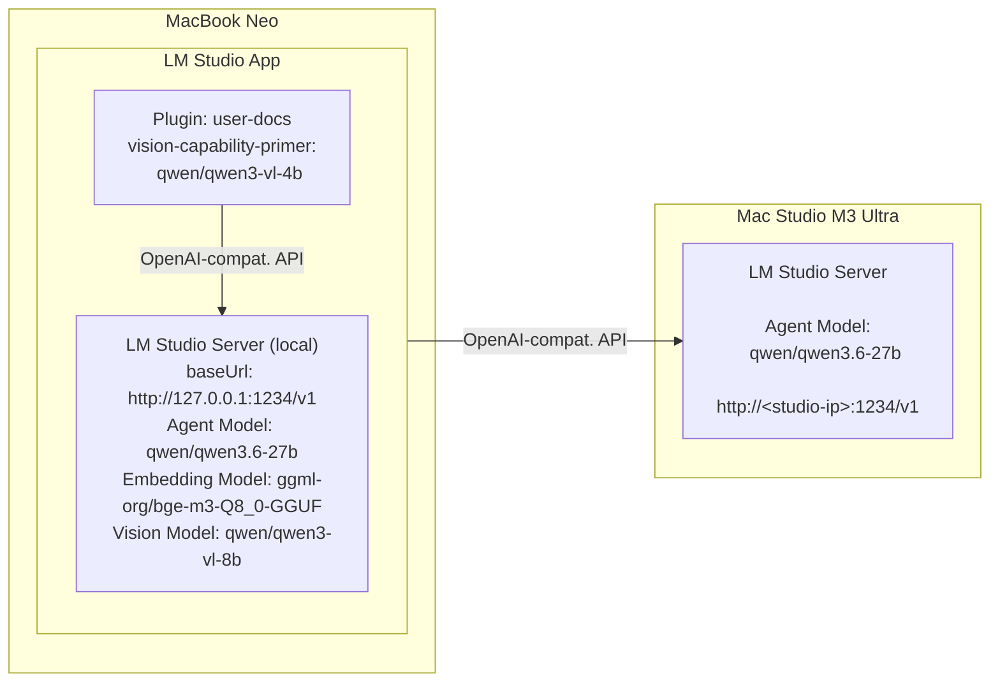

# user-docs – Deployment Scenarios

## Scenario 1 – Single Machine (e.g. MacBook Pro M5)

All components run on one machine. LM Studio acts as both client and server.
The plugin communicates with both the local LM Studio server and the local Draw Things backend.

```
┌──────────────────────────────────────────────────────────────────┐
│  MacBook Pro M5                                                  │
│                                                                  │
│  ┌────────────────────────────────────────────────────────────┐  │
│  │  LM Studio App                                             │  │
│  │                                                            │  │
│  │  ┌──────────────────────────────────────────────────────┐  │  │
│  │  │  Plugin: user-docs                                   │  │  │
│  │  │                                                      │  │  │
│  │  │  vision-capability-primer: qwen/qwen3-vl-4b          │  │  │
│  │  └──────────────────────────────────────────────────────┘  │  │
│  │                           │                                │  │
│  │                           │ OpenAI-compat. API             │  │
│  │                           ▼                                │  │
│  │  ┌──────────────────────────────────────────────────────┐  │  │
│  │  │  LM Studio Server (local)                            │  │  │
│  │  │  baseUrl: http://127.0.0.1:1234/v1                   │  │  │
│  │  │  Agent Model: qwen/qwen3.6-27b                       │  │  │
│  │  │  Embedding Model: ggml-org/bge-m3-Q8_0-GGUF          │  │  │
│  │  │  Vision Model: qwen/qwen3-vl-8b                      │  │  │
│  │  └──────────────────────────────────────────────────────┘  │  │
│  └────────────────────────────────────────────────────────────┘  │
│                                                                  │
└──────────────────────────────────────────────────────────────────┘

```



**Plugin settings (defaults):**

| Setting                        | Value                       |
| ------------------------------ | --------------------------- |
| `model`                        | `qwen/qwen3.6-35b-a3b`      |
| `baseUrl` / `embeddingBaseUrl` | `http://127.0.0.1:1234/v1`  |
| `embeddingModel`.              | `ggml-org/bge-m3-Q8_0-GGUF` |
| `qwen3VlModelPath`             | `qwen/qwen3-vl-8b`          |

---

## Scenario 2 – Two Machines (e.g. MacBook Neo + Mac Studio M3 Ultra)

LM Studio Client and LM Studio backend share one machine.
The LM Studio Server (agent inference) runs on a dedicated, more powerful machine.
The plugin always maintains two connections: one to the local LM Studio Server, one to the agent inference backend.

```
┌──────────────────────────────────────────────────────────────────┐
│  MacBook Neo                                                     │
│                                                                  │
│  ┌────────────────────────────────────────────────────────────┐  │   ┌─────────────────────────────┐
│  │  LM Studio App                                             │  │   │  Mac Studio M3 Ultra        │
│  │                                                            │  │   │                             │
│  │  ┌──────────────────────────────────────────────────────┐  │  │   │                             │
│  │  │  Plugin: user-docs                                   │  │  │   │  LM Studio Server           │
│  │  │                                                      │  │  │   │                             │
│  │  │  vision-capability-primer: qwen/qwen3-vl-4b          │  │  │   │                             │
│  │  └──────────────────────────────────────────────────────┘  │  │   │  Agent Model:               │
│  │                           │                                │  │   │  qwen/qwen3.6-27b           │
│  │                           │ OpenAI-compat. API ───────────────│──▶︎│  http://<studio-ip>:1234/v1 │
│  │                           ▼                                │  │   │                             │
│  │  ┌──────────────────────────────────────────────────────┐  │  │   │                             │
│  │  │  LM Studio Server (local)                            │  │  │   │                             │
│  │  │  baseUrl: http://127.0.0.1:1234/v1                   │  │  │   │                             │
│  │  │  Agent Model: qwen/qwen3.6-27b                       │  │  │   │                             │
│  │  │  Embedding Model: ggml-org/bge-m3-Q8_0-GGUF          │  │  │   │                             │
│  │  │  Vision Model: qwen/qwen3-vl-8b                      │  │  │   │                             │
│  │  └──────────────────────────────────────────────────────┘  │  │   └─────────────────────────────┘
│  └────────────────────────────────────────────────────────────┘  │
│                                                                  │
└──────────────────────────────────────────────────────────────────┘

```



**Plugin settings:**

| Setting            | Value                       |
| ------------------ | --------------------------- |
| `model`            | `qwen/qwen3.6-35b-a3b`      |
| `baseUrl`          | `http://127.0.0.1:1234/v1`  |
| `embeddingModel`.  | `ggml-org/bge-m3-Q8_0-GGUF` |
| `qwen3VlModelPath` | `qwen/qwen3-vl-8b`          |
| `embeddingBaseUrl` | `http://127.0.0.1:1234/v1`  |
